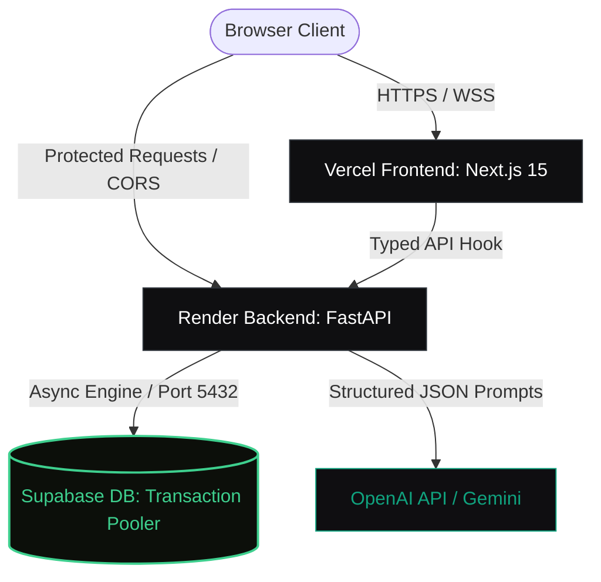

# 🌌 ApexCV: AI Resume Analyser SaaS

A production-grade, full-stack AI Resume Analyser platform built with a cinematic dark-mode UI, modular FastAPI backend, and robust Supabase/PostgreSQL schema.

---

<p align="left">
  
  
  
  
  
</p>

- **🌐 Live Production Web App**: [https://apexcv-five.vercel.app](https://apexcv-five.vercel.app)
- **⚡ Live Backend API**: [https://ai-resume-analyser-0b29.onrender.com](https://ai-resume-analyser-0b29.onrender.com)

---

## 🔮 System Architecture

The monorepo operates on a decoupled client-server architecture designed for lightning-fast parsing and highly structured database persistence.



---

## ✨ Key Capabilities

| Domain | Highlight Feature | Engineering Detail |
| :--- | :--- | :--- |
| **🎨 User Experience** | **Cinematic dark interface** with glassmorphism, responsive dashboard grids, and smooth staggered animations. | Styled with Vanilla Tailwind CSS, managed with Zustand, animated with Framer Motion. |
| **🤖 AI Parsing** | **ATS Score extraction**, missing keyword matching, and targeted bullet-point recommendations. | Utilizes OpenAI structured JSON outputs and clean fallbacks. |
| **⚡ Database** | **Supabase Transaction Pooler** (port `5432`) integration. | Asyncpg connection tuning with disabled statement caching to avoid pooled duplicate statement conflicts. |
| **🔒 Security** | **Robust CORS origin matching** and JWT token state propagation. | Custom validator parsed via Pydantic to cleanly bind local development and production Vercel domains. |

---

## 📂 Codebase Tour

```text
.
├── apps/
│   ├── api/                     # 🐍 Python FastAPI Service
│   │   ├── app/
│   │   │   ├── api/             # Routers & endpoint definitions
│   │   │   ├── core/            # Configuration & Pydantic settings
│   │   │   ├── db/              # Database connection & pooling configuration
│   │   │   ├── middleware/      # Rate-limiting & CORS filters
│   │   │   └── models/          # SQLAlchemy async schemas
│   │   ├── alembic/             # Database migration versions
│   │   └── Dockerfile
│   └── web/                     # ⚛️ Next.js 15 Web Application
│       ├── src/
│       │   ├── app/             # Page routing and UI layouts
│       │   ├── components/      # UI components & design primitives
│       │   └── lib/             # API clients & client hooks
│       └── Dockerfile
└── docker-compose.yml
```

---

## 🛠️ Local Sandbox

To spin up the entire stack (including local database, reverse proxy, frontend, and backend) instantly:

```bash
# Clone and enter the workspace
git clone https://github.com/Dinezx/AI-Resume-Analyser.git
cd AI-Resume-Analyser

# Launch the orchestrator
docker compose up --build
```

- **Frontend**: http://localhost:3000
- **FastAPI Sandbox**: http://localhost:8000/docs
- **Nginx Entrypoint**: http://localhost:80

---

## 🧪 Bare Metal Manual Execution

### 1. Spin up the FastAPI Backend
```bash
cd apps/api

# Create and boot the environment
python -m venv .venv
.\.venv\Scripts\Activate.ps1   # Windows
source .venv/bin/activate      # Unix

# Install dependencies and update schema
pip install -r requirements.txt
alembic upgrade head

# Run live reloading server
uvicorn app.main:app --reload --port 8000
```

### 2. Boot up the Next.js Frontend
```bash
cd apps/web

# Install dependencies and launch dev server
npm install
npm run dev
```

---

## 🚀 Cloud Deployment

### Web Client (Vercel)
1. Point Vercel to the `apps/web` directory.
2. Provide the build command: `npm run build`.
3. Set the environment variable `NEXT_PUBLIC_API_URL` targeting your production Render endpoint.

### Backend Api (Render / AWS)
1. Deploy `apps/api` using the included `Dockerfile`.
2. Configure the following environment variables:
   - `DATABASE_URL`: Your Supabase async transaction pooler string.
   - `CORS_ORIGINS`: JSON string of allowed client URLs.
3. Configure the container start-up commands to apply migrations:
   ```bash
   alembic upgrade head && uvicorn app.main:app --host 0.0.0.0 --port 8000
   ```
